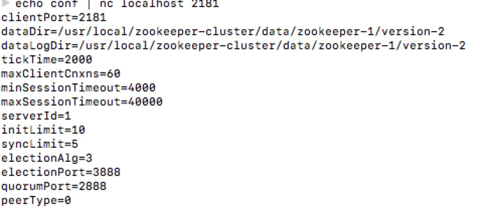
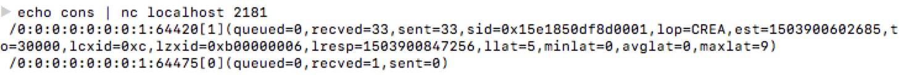

#配置

## 1. 常用配置
1. clientPort: 服务器对外服务端口，必须配置，无默认值，一般设定为2181。
2. dataDir: 服务器存储快照的存放目录，默认情况下如果没有配置dataLogDir，事务日志也会记录在改目录下。
考虑到事务日志的写性能直接影响Zookeeper整体的服务能力，建议单独的指定目录来存放事务日志。
3. tickTime: 最小时间单位长度，单位毫秒，默认值2000。例如默认会话最小超时时间2*tickTime即为4s钟。
4. dataLogDir: zk事务日志存放目录，尽量不要和zk数据快照放在同一个目录下。如果有条件可以使用单独的磁盘挂载
点，将极大的提升zk的整体性能。

## 2. 高级配置
1. initLimit: 默认值10个tickTime周期。表示在zk启动过程中允许follower从leader完成数据同步的时间。
2. syncLimit: 默认值5个tickTime周期。该参数用户配置Leader服务器和Follower之间进行心跳检测的最大延迟时间。
3. snapCount: 默认值100000（仅支持系统属性方式指定，zookeeper.snapCount）配置相邻两次快照之间事务操作次数。即zk
进行snapCount次事务操作之后进行一次数据快照。
4. preAllocSize: 默认值65536，单位kb，大小64M（仅支持系统方式指定，zookeeper.preAllocSize）。该参数用于配置预分配事务日志文件大小。通常snapCount参数变更，该参数也需要进行调整。
5. minSessionTimeout、maxSessionTimeout: 默认值分别是tickTime的2倍和20倍。用于服务端对客户端的会话超时间的限制，如果客户端设定的超时时间不在这个范围内会被强制重置为最大值或者最小值。
6. server.id=host : port : port: 没有默认参数，单机模式下可以不用配置。该参数用于配置组成zk集群的机器列表，其中id即为ServerID,与每台服务器myid文件中的数据相对应。第一个端口用于指定Follower服务器和Leader
进行运行时通讯和数据同步时所用的端口，第二端口用于进行Leader选举过程中的通票通讯。
7. autopurge.snapRetainCount: zk在3.4版本开始提供了自动清除日志和数据快照的功能。该参数用于指定自动清除时保留日志和数据快照的最小数量。需要注意的是并不是磁盘上所有事务日志和数据快照都可以被清除，那样就无法恢复数据，因此autopurge.snapRetainCount最小值为3，如果设定的值小于3，也会被自动调整到3。
8. autopurge.purgeInterval: 该值默认值为0，单位是小时，和autopurge.snapRetainCount配合使用。用户配置zk进行历史文件自动清理的频率。如果配置为0或者负数，那么就表示不需要启动定时清理功能。

# 可视化日志
## 1. 事务日志
`java -cp ../../../../zookeeper-3.4.10/zookeeper-3.4.10.jar:../../../../zookeeper-3.4.10/lib/slf4j-api-1.6.1.jar org.apache.zookeeper.server.LogFormatter log.100000001`

## 2. 数据快照
`java -cp ../../../../zookeeper-3.4.10/zookeeper-3.4.10.jar:../../../../zookeeper-3.4.10/lib/slf4j-api-1.6.1.jar org.apache.zookeeper.server.SnapshotFormatter snapshot.100000000`

# 四字命令
## 使用方式
1. telnet host port
2. nc方式 echo cmd | nc host port

## 命令
1. conf 显示相关信息配置

2. cons 输出与当前服务器连接的所有客户端详细信息

3. crst 功能性命令，重置所有的客户端连接统计信息
4. dump 输出当前集群中所有的会话信息
5. envi 输出当前zookeeper服务器运行时的环境信息
6. ruok 'are you ok',输出当前ZK服务器是否正在运行，如果是正常的则会输出imok，没有实际意义的一条命令，并不能真切的反映出应用服务的真是状态。
7. stat 获取当前ZK服务器的运行时状态信息
8. srvr 和stat命令功能一致，但是不会讲客户端的连接情况输出，仅仅输出服务器的自身的信息。
9. mntr 输出比stat更为详尽的服务器统计信息。
10. srst 功能性命令，用于重置所有服务器的统计信息
11. wchs 输出当前服务器上管理的Watcher的概要信息
12. wchc 输出当前服务器上管理的Watcher的详细信息，以会话组为单位拟进行分组显示。
13. wchp 输出当前服务器上管理的Watcher的详细信息，以路径为单位拟进行分组显示。
